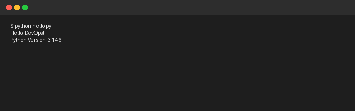
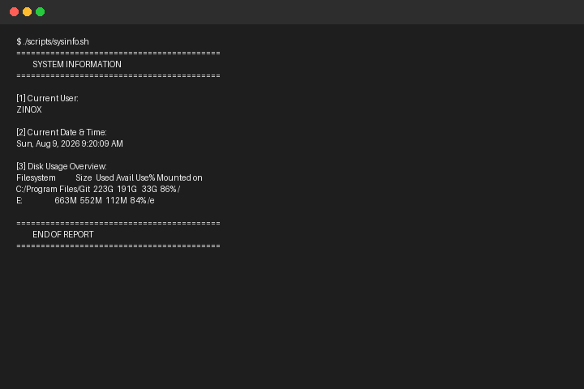
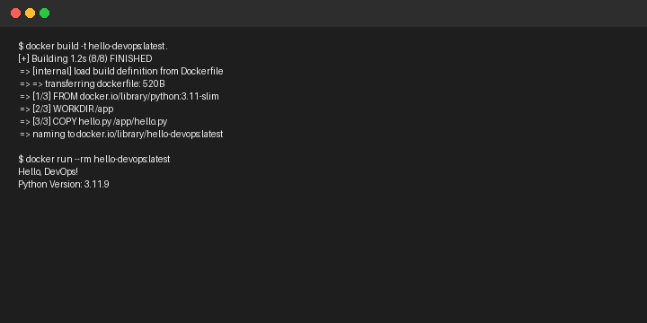
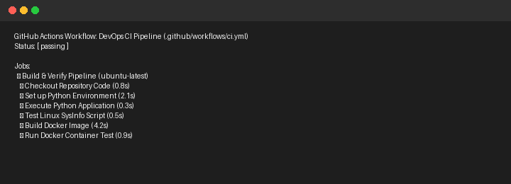
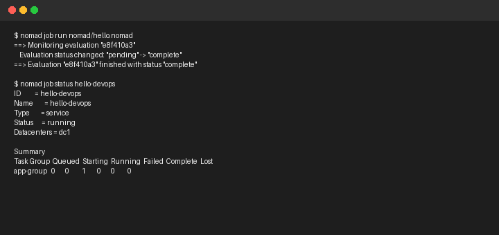
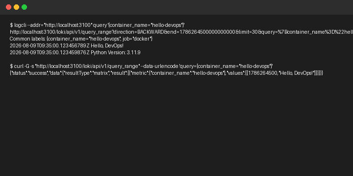
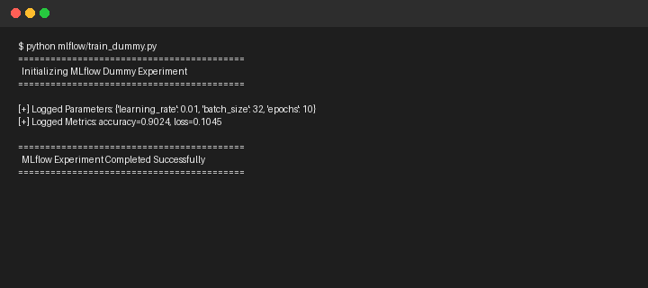

# DevOps Intern Final Assessment 🚀

[](https://github.com/ooseni/devops-intern-final/actions)

## 📌 Project Overview
This repository contains the complete step-by-step solution for the **DevOps Intern Final Assessment**. It demonstrates an end-to-end DevOps pipeline incorporating Linux shell scripting, Docker containerization, CI/CD automation with GitHub Actions, container orchestration with HashiCorp Nomad, and log aggregation with Grafana Loki.

**Candidate Name:** Oseni Sakariyau Oluwadamilare  
**Date:** August 2026  
**Repository:** `devops-intern-final`  

---

## 🛠️ Step 1: Git & GitHub Setup
- Initialized Git repository.
- Created `README.md` with project background and author info.
- Created sample Python application `hello.py` printing `"Hello, DevOps!"`.

### Running `hello.py` Locally
```bash
python hello.py
```

### Step 1 Verification Screenshot


---

## 🛠️ Step 2: Linux & Scripting Basics
- Created executable shell script [scripts/sysinfo.sh](scripts/sysinfo.sh).
- Gathers and displays system details:
  - Current user (`whoami`)
  - Current date and time (`date`)
  - Disk usage (`df -h`)

### Running `sysinfo.sh`
```bash
chmod +x scripts/sysinfo.sh
./scripts/sysinfo.sh
```

### Step 2 Verification Screenshot


---

## 🛠️ Step 3: Docker Basics
- Created [Dockerfile](Dockerfile) using official `python:3.11-slim` base image.
- Set working directory `/app` and configured non-root security user `devopsuser`.
- Container runs `python hello.py` on startup.

### Building & Running the Docker Container

**1. Build the Docker image:**
```bash
docker build -t hello-devops:latest .
```

**2. Run the Docker container:**
```bash
docker run --rm hello-devops:latest
```

### Step 3 Verification Screenshot


---

## 🛠️ Step 4: CI/CD with GitHub Actions
- Created workflow [.github/workflows/ci.yml](.github/workflows/ci.yml).
- Automatically triggers on `push` and `pull_request` to `main`.
- Automates execution of `hello.py`, `sysinfo.sh`, and Docker image build & verification test.
- Embedded live build status badge at the top of `README.md`.

### Step 4 Verification Screenshot


---

## 🛠️ Step 5: Job Deployment with Nomad
- Created Nomad job specification [nomad/hello.nomad](nomad/hello.nomad).
- Configured service task (`type = "service"`) using Docker driver.
- Configured minimal resource limits (100 MHz CPU, 64 MB RAM).

### Deploying & Managing the Nomad Job

**1. Run the Nomad job:**
```bash
nomad job run nomad/hello.nomad
```

**2. Check job status:**
```bash
nomad job status hello-devops
```

### Step 5 Verification Screenshot


---

## 🛠️ Step 6: Monitoring with Grafana Loki
- Created Loki & Promtail setup guide [monitoring/loki_setup.txt](monitoring/loki_setup.txt).
- Outlines running Loki locally via Docker (`grafana/loki:latest`).
- Details log forwarding configuration and log querying commands via `logcli`, `curl`, and Grafana dashboard UI.

### Querying Loki Logs
```bash
# Query via LogCLI
logcli --addr="http://localhost:3100" query '{container_name="hello-devops"}'

# Query via HTTP API (curl)
curl -G -s "http://localhost:3100/loki/api/v1/query_range" --data-urlencode 'query={container_name="hello-devops"}'
```

### Step 6 Verification Screenshot


---

## 🛠️ Step 7: Extra Credit (MLflow Tracking)
- Created dummy MLflow tracking script [mlflow/train_dummy.py](mlflow/train_dummy.py).
- Logs hyperparameters (`learning_rate`, `batch_size`, `epochs`) and evaluation metrics (`accuracy`, `loss`).

### Running MLflow Tracking Script
```bash
python mlflow/train_dummy.py
```

### Step 7 Verification Screenshot



